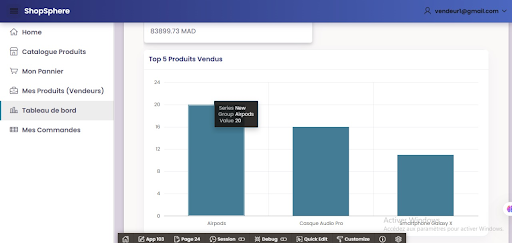

# 🛍️ Marketplace_E-Commerce_Multi-Vendeurs

[](https://www.oracle.com/database/)
[](https://www.oracle.com/database/technologies/appdev/plsql.html)
[](https://apex.oracle.com/)
[](https://fr.wikipedia.org/wiki/MERISE)

---

## 📸 Aperçu de l'application
<div align="center">
  
  <br/>
  <em>Figure 1 : Page de connexion - Authentification utilisateur</em>
</div>

<div align="center">
  
  <br/>
  <em>Figure 2 : Interface du panier et validation de commande</em>
</div>

<div align="center">
  
  <br/>
  <em>Figure 3 : Vitrine publique - Liste des produits par catégorie</em>
</div>

<br/>

<div align="center">
  
  <br/>
  <em>Figure 4 : Espace vendeur - Tableau de bord et chiffre d'affaires</em>
</div>


---

## 🎯 Objectif du projet

Ce projet vise à appliquer les notions de **modélisation conceptuelle**, **programmation PL/SQL** et **développement Oracle APEX** à travers la conception et la réalisation d'une **marketplace e-commerce multi-vendeurs**.

| Domaine | Compétences |
|---------|-------------|
| 📐 **Modélisation** | MERISE (MCD, MLD, DDE, GDF) |
| 💾 **PL/SQL** | Triggers, procédures, fonctions, transactions |
| 🖥️ **Interface** | Oracle APEX |

---

## 🛠️ Technologies utilisées

| Catégorie | Technologie |
|-----------|-------------|
| SGBD | Oracle Database XE |
| IDE | Oracle SQL Developer |
| Interface | Oracle APEX |
| Modélisation | Draw.io |
| Versioning | Git / GitHub |

---

## 📋 Fonctionnalités

### 👥 Gestion des utilisateurs

| Rôle | Fonctionnalités |
|------|-----------------|
| 🛒 **Client** | Inscription, consultation produits, panier, commandes, avis |
| 🏪 **Vendeur** | Gestion produits (CRUD), tableau de bord (CA, meilleures ventes) |
| 👑 **Administrateur** | Gestion utilisateurs, supervision ventes |

### 📦 Gestion des commandes

- Création de commande multi-produits (multi-vendeurs)
- Statuts : **Pending** → **Paid** → **Shipped**
- Application de coupons de réduction
- Suivi d'expédition

### 🔧 Contraintes PL/SQL

| Règle | Implémentation |
|-------|----------------|
| Gestion du stock | Décrémentation automatique + vérification stock > 0 |
| Gestion des statuts | Triggers automatisant les transitions |
| Coupon de réduction | Fonction de calcul avec coupon valide |
| Transactions | SAVEPOINT, ROLLBACK, COMMIT |
| Remboursement | Procédure créditant client + restauration stock |
| Journalisation | Table LOG_ACTIONS + triggers automatiques |

### ⭐ Avis et évaluations

- Dépôt d'avis et notes sur produits achetés

---

## 🗄️ Structure de la base de données

| Table | Description |
|-------|-------------|
| `CLIENT` | Clients de la plateforme |
| `VENDEUR` | Vendeurs sur la plateforme |
| `CATEGORIE` | Catégories de produits |
| `PRODUIT` | Produits mis en vente |
| `COMMANDE` | Commandes passées |
| `LIGNE_COMMANDE` | Lignes de commande |
| `PAIEMENT` | Paiements effectués |
| `EXPEDITION` | Expéditions des commandes |
| `AVIS` | Avis sur les produits |
| `COUPON` | Codes de réduction |
| `LOG_ACTIONS` | Journal d'audit |

---

## 📦 Installation rapide

```sql
-- Création utilisateur Oracle
CREATE USER marketplace IDENTIFIED BY password;
GRANT CONNECT, RESOURCE, UNLIMITED TABLESPACE TO marketplace;

-- Exécution des scripts (ordre chronologique)
@scripts/01_create_tables.sql
@scripts/02_seed_data.sql
@scripts/03_constraints.sql
@scripts/04_triggers.sql
@scripts/05_procedures_functions.sql
@scripts/06_logs.sql
